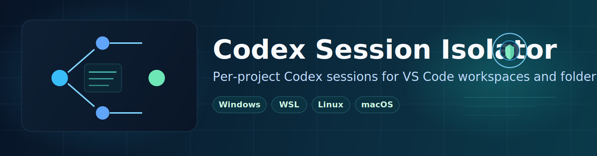

# Codex Session Isolator



[](https://github.com/mahdiahmadi1991/codex-session-isolator/actions/workflows/ci.yml)
[](https://github.com/mahdiahmadi1991/codex-session-isolator/actions/workflows/security.yml)
[](https://github.com/mahdiahmadi1991/codex-session-isolator/releases)
[](LICENSE)

Codex Session Isolator gives each code environment its own Codex session state.

When launched through this tool, `CODEX_HOME` is set to:

`<target-directory>/.codex`

`<target-directory>` is:

- the workspace directory (if target is a `.code-workspace` file)
- the folder itself (if target is a directory)
- the parent directory (if target is any file)

This isolates Codex state per project without changing global/default behavior.

Practical effect:

- When you open a project via launcher, you see that project's own Codex state.
- Global/default chat history from other projects is not shown in that isolated session.
- You can keep separate Codex sign-in/API-key setups per project because each project has its own `.codex` home.

## Highlights

- Works with Windows, WSL, Linux, and macOS.
- Supports Windows paths, Linux paths, and WSL UNC paths.
- Does not modify shell profiles or global Codex settings.
- Keeps per-project Codex state isolated.
- Supports both workspace files and plain folders (no workspace required).
- Includes an interactive launcher wizard for generating project-specific launchers.

## Project Structure

- `launchers/CodexSessionIsolator.ps1` - Primary smart launcher for Windows.
- `launchers/codex-session-isolator.bat` - Canonical batch launcher for Windows.
- `launchers/codex-session-isolator.sh` - Canonical launcher for Linux/macOS.
- `tools/vsc-launcher.ps1` - Cross-platform wizard helper core.
- `tools/vsc-launcher.bat` - Wizard helper entrypoint for Windows.
- `tools/vsc-launcher.sh` - Wizard helper entrypoint for Linux/macOS.
- `extension/` - VS Code extension (hybrid UX layer over launcher wizard).
- `AGENTS.md` - Quick onboarding guide for AI coding agents.
- `codex-session-isolator.code-workspace` - Recommended VS Code workspace for this repository.
- `tests/Test-Windows.ps1` - End-to-end Windows integration tests.
- `tests/test-linux.sh` - End-to-end Unix integration tests (Linux and macOS).
- `docs/USAGE.md` - Usage reference (workspace or folder target).
- `docs/TESTING.md` - Manual test matrix.

## Quick Start

### Wizard helper (recommended)

Windows (CMD):

```bat
.\tools\vsc-launcher.bat "C:\path\to\project"
.\tools\vsc-launcher.bat "C:\path\to\project" --debug
```

Windows (PowerShell):

```powershell
.\tools\vsc-launcher.ps1 "C:\path\to\project"
.\tools\vsc-launcher.ps1 "C:\path\to\project" --debug
```

Linux/macOS:

```bash
chmod +x ./tools/vsc-launcher.sh
./tools/vsc-launcher.sh "/path/to/project"
./tools/vsc-launcher.sh "/path/to/project" --debug
```

Helper options:

- `--help` show usage
- `--debug` generate launcher with logging enabled by default
- `--target <path>` pass target explicitly

Direct wizard (advanced):

```powershell
powershell -NoProfile -ExecutionPolicy Bypass -File .\tools\vsc-launcher-wizard.ps1 -TargetPath "C:\path\to\project"
```

Note: direct wizard execution requires PowerShell (`powershell` or `pwsh`).

The wizard asks for:

- Remote WSL mode
- whether Codex should run in WSL for this project
- whether Codex chat sessions should be git-ignored

Wizard defaults:

- If exactly one workspace file exists in target path, it is selected automatically.
- If no workspace file exists, folder target is used.
- It asks workspace selection only when more than one workspace file is found.
- If WSL is not installed/available, WSL-related questions are skipped automatically.
- Wizard remembers your previous answers per target (`.vsc_launcher/wizard.defaults.json`) and reuses them as defaults.
- First-run defaults on Windows (when WSL is available) are:
  - `Launch VS Code in Remote WSL mode = Yes`
  - `Set Codex to run in WSL for this project = Yes`
  - WSL distro default = your Windows default distro (`wsl --status`)
  - `Ignore Codex chat sessions in gitignore = No`
- Logging is disabled by default and enabled only when running wizard with `--debug`.
- On Windows, it generates one executable launcher file in target root (`vsc_launcher.bat`) and stores metadata in `.vsc_launcher/`.
- Wizard always writes:
  - `chatgpt.openOnStartup=true`
  - `chatgpt.runCodexInWindowsSubsystemForLinux=<selected>`
  in `.vscode/settings.json`, and also in `.code-workspace` settings when launch target is a workspace file.
- In local Windows mode, generated launcher runs VS Code with a project-scoped `--user-data-dir` under `.vsc_launcher/` to ensure `CODEX_HOME` is applied reliably.
- In Remote WSL mode, launcher skips isolated `--user-data-dir` because WSL `code` CLI does not support that option.
- When `chatgpt.runCodexInWindowsSubsystemForLinux=true` and launch mode is local Windows, launcher configures an isolated `chatgpt.cliExecutable` wrapper in the project profile to force project `CODEX_HOME` for Codex app-server.

### VS Code extension (preview)

The extension adds in-editor commands for wizard UX and launcher operations:

- `Codex Session Isolator: Initialize Launcher`
- `Codex Session Isolator: Reopen With Launcher`
- `Codex Session Isolator: Open Launcher Logs`
- `Codex Session Isolator: Open Launcher Config`

Marketplace identifier:

- `2ma.codex-session-isolator`

Quick start (Marketplace install -> setup -> verify):

1. Install `2ma.codex-session-isolator` from VS Code Marketplace.
2. Open your project in VS Code.
3. Setup launcher:
   - If available in your installed version, run `Codex Session Isolator: Setup (Initialize & Reopen)`.
   - Otherwise run `Codex Session Isolator: Initialize Launcher`, then `Codex Session Isolator: Reopen With Launcher`.
4. Verify in terminal:
   - Windows PowerShell: `echo $env:CODEX_HOME`
   - bash/zsh: `echo "$CODEX_HOME"`
5. Expected value: `<project-root>/.codex` (or Linux-equivalent path in WSL/Unix mode).

Development run:

```bash
cd extension
npm install
npm run compile
```

Then press `F5` in VS Code from the `extension` folder to run the Extension Development Host.

### Windows

```powershell
powershell -NoProfile -ExecutionPolicy Bypass -File .\launchers\CodexSessionIsolator.ps1 -TargetPath "C:\dev\my-app\MyApp.code-workspace"
powershell -NoProfile -ExecutionPolicy Bypass -File .\launchers\CodexSessionIsolator.ps1 -TargetPath "C:\dev\my-app"
```

Or with wrapper:

```bat
.\launchers\codex-session-isolator.bat "C:\dev\my-app\MyApp.code-workspace"
.\launchers\codex-session-isolator.bat "C:\dev\my-app"
```

### Windows -> WSL project target

If your project is inside WSL, pass a WSL UNC path:

```bat
.\tools\vsc-launcher.bat "\\wsl$\Ubuntu-24.04\home\user\my-app"
```

Recommended:

1. Keep `Launch VS Code in Remote WSL mode` on `Yes` (default).
2. Keep `Set Codex to run in WSL` on `Yes` (default).
3. Reopen with generated `vsc_launcher.bat`.

Note:

- If you open `\\wsl$\...` in a local Windows window, VS Code may show the hint to reopen in WSL. This is expected.
- Remote WSL mode avoids that mismatch and keeps terminal/extensions/Codex in Linux context.

### Linux/macOS

```bash
chmod +x ./launchers/codex-session-isolator.sh
./launchers/codex-session-isolator.sh /path/to/my-app/MyApp.code-workspace
./launchers/codex-session-isolator.sh /path/to/my-app
```

## Cleanup/Uninstall

To remove generated launcher artifacts safely from a project:

1. Delete launcher file from project root:
   - `vsc_launcher.bat` (Windows) or `vsc_launcher.sh` (Linux/macOS)
2. Delete `.vsc_launcher/` (config/logs/backups).
3. Remove managed `.gitignore` block:
   - from `# >>> codex-session-isolator >>>`
   - to `# <<< codex-session-isolator <<<`
4. Optional: remove extension-managed settings keys:
   - `chatgpt.runCodexInWindowsSubsystemForLinux`
   - `chatgpt.openOnStartup`
   - `chatgpt.cliExecutable` (only if set to `.vsc_launcher/codex-wsl-wrapper.sh`)
5. Optional: delete project `.codex/` only if you do not need that project's isolated session state/history.

## Troubleshooting

- Wizard fails immediately:
  ensure PowerShell is installed (`pwsh` or `powershell.exe`), then retry.
- Reopen fails with launcher missing:
  run Initialize first (or one-click setup command if your version provides it).
- WSL options are missing:
  verify `wsl --status`; if unavailable, use local mode or install/configure WSL.
- Permission/write errors:
  check folder write access. Backup copies for managed overwrites are under `.vsc_launcher/backups/`.
- Where to inspect logs:
  1. VS Code Output channel: `Codex Session Isolator`
  2. Project logs: `.vsc_launcher/logs`

## Documentation

- Usage: `docs/USAGE.md`
- AI agent onboarding: `AGENTS.md`
- Extension usage: `docs/EXTENSION.md`
- Marketplace prep: `docs/MARKETPLACE.md`
- Trust model: `docs/TRUST.md`
- Test scenarios: `docs/TESTING.md`
- Release steps: `docs/RELEASE.md`
- Release notes template: `docs/RELEASE_TEMPLATE.md`
- Contribution guide: `CONTRIBUTING.md`
- Privacy notice: `PRIVACY.md`
- Security policy: `SECURITY.md`

## Security and Safety

- Launcher and wizard operations are project-scoped.
- Project scripts are local-first and do not include built-in telemetry uploads.
- Before overwriting managed files, safety backups are created under:
  - `<target>/.vsc_launcher/backups/<timestamp-pid>/`
- Extension initialization requires trusted workspace and explicit confirmation by default.
- Marketplace CI generates VSIX checksum files for verification.
- Security CI workflow runs dependency review, secret scan, script syntax validation, npm audit, and CodeQL analysis.

## Marketplace CI/CD

Marketplace automation is provided by `.github/workflows/extension-publish.yml`.

- Branch model:
  - `pre-release`: integration branch. Every push/merge auto-publishes Marketplace pre-release.
  - `main`: stable branch. Stable publish happens from GitHub Release (`release.published`).
- CI/Security workflows run only for `main` and `pre-release` (push + pull request).
- Stable publish: create a GitHub Release tag that matches extension version (`v<version>`).
- Manual publish: run the `Extension Publish` workflow via `workflow_dispatch` (`pre-release` or `stable`).

Required repository secret:

- `VSCE_PAT` (Visual Studio Marketplace token for publisher `2ma`)

## License

MIT
