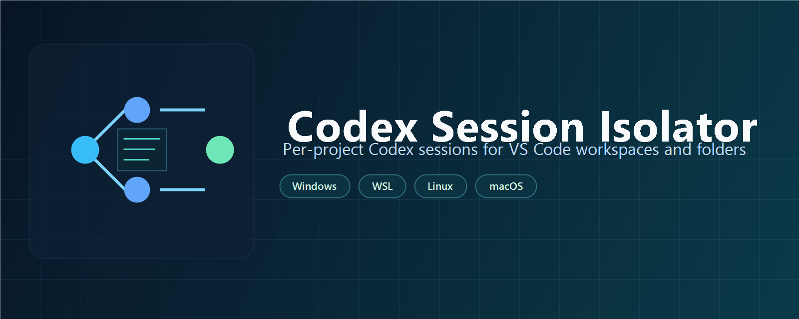

# Codex Session Isolator

Per-project Codex session isolation for VS Code targets (workspaces or folders).



## Why this extension

This extension gives you a guided VS Code UX for creating and using project-scoped launcher files.
It keeps Codex session state isolated per project by driving the existing launcher backend.

## What it does

- Initializes launcher files inside the selected project root.
- Reopens VS Code through the generated launcher.
- Opens launcher logs for debugging.
- Opens launcher config quickly for inspection.

When launched through generated launcher:

- `CODEX_HOME` is set to `<project>/.codex` for that session.
- Default/global behavior remains unchanged outside launcher flow.
- Chat/session state is isolated per project, so global/default history from other projects is not shown.
- Different project roots can use different Codex account/API-key context.

## Commands

- `Codex Session Isolator: Setup (Initialize & Reopen)`
- `Codex Session Isolator: Initialize Launcher`
- `Codex Session Isolator: Reopen With Launcher`
- `Codex Session Isolator: Open Launcher Logs`
- `Codex Session Isolator: Open Launcher Config`

## Quick Start

1. Open your project folder/workspace in VS Code.
2. Run `Codex Session Isolator: Setup (Initialize & Reopen)`.
3. Answer wizard questions.
4. VS Code reopens through the generated launcher automatically.
5. Verify in terminal:
   - Windows PowerShell: `echo $env:CODEX_HOME`
   - bash/zsh: `echo "$CODEX_HOME"`

Manual flow is still available:

1. `Codex Session Isolator: Initialize Launcher`
2. `Codex Session Isolator: Reopen With Launcher`

Expected value:

- `<project-root>/.codex` (or Linux path equivalent in WSL/Unix modes)

Default wizard answers on Windows + WSL:

- Remote WSL launch: `Yes`
- Codex run in WSL: `Yes`
- Distro default: Windows default distro
- Ignore Codex chat sessions in gitignore: `No`

If your target is under `\\wsl$\...`, keep Remote WSL launch enabled to avoid mixed Windows/WSL context warnings in VS Code.

## Requirements

- VS Code 1.95+
- PowerShell available (`powershell` or `pwsh`)
- Optional for WSL modes: WSL installed and configured

## Settings

- `codexSessionIsolator.debugWizardByDefault`
- `codexSessionIsolator.closeWindowAfterReopen`
- `codexSessionIsolator.requireConfirmation`

## Security and Privacy

- The extension does not send telemetry and does not upload your project files.
- All launcher generation is local and runs through a bundled PowerShell script in this extension package.
- The extension requires a trusted workspace before running launcher or wizard scripts.
- By default, the extension asks for explicit confirmation before initialization.
- Before overwriting managed files, the wizard creates safety backups under:
  - `<project>/.vsc_launcher/backups/<timestamp-pid>/`

## Troubleshooting

- If launcher generation fails, check Output channel: `Codex Session Isolator`.
- Use `Open Launcher Logs` command and inspect `.vsc_launcher/logs`.
- If WSL options do not appear, verify `wsl --status` succeeds on system.

## Source

- Repository: https://github.com/mahdiahmadi1991/codex-session-isolator
- Issues: https://github.com/mahdiahmadi1991/codex-session-isolator/issues
- Discussions: https://github.com/mahdiahmadi1991/codex-session-isolator/discussions

## Development

```bash
cd extension
npm install
npm run compile
```

Press `F5` in VS Code (from `extension` folder) to run Extension Development Host.
